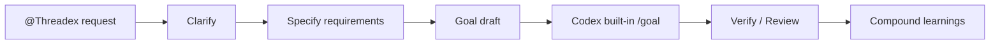

<div align="center">
  

  <h1>Threadex</h1>

  <p><strong>Codex 작업을 모호한 요청에서 검증 가능한 /goal 프롬프트로 엮는 얇은 harness</strong></p>

  <p>
    <a href="#codex-app에-설치"><strong>Codex app 설치</strong></a>
    ·
    <a href="#로컬-검증-요청"><strong>로컬 검증 요청</strong></a>
    ·
    <a href="#빠른-시작"><strong>빠른 시작</strong></a>
    ·
    <a href="#어떻게-돌아가나"><strong>흐름</strong></a>
    ·
    <a href="#더-살펴보기"><strong>더 보기</strong></a>
  </p>

  <p>
    
    
    
  </p>
</div>

---

## 한 줄로 말하면

Threadex는 Codex에게 일을 맡기기 전에 **무엇이 모호한지**, **어떤 요구사항이면 충분한지**, **어떤 /goal 프롬프트로 넘길지**, **무엇으로 검증할지**를 짧게 고정합니다.

그래서 Codex가 바로 구현으로 뛰어들기보다, 아래처럼 확인 가능한 작업 흐름을 남기게 합니다.

| Codex 작업에서 자주 생기는 문제 | Threadex가 고정하는 것 | 쉬운 뜻 |
| --- | --- | --- |
| 요구사항이 모호함 | `clarify` | 한 번에 한 질문으로 빠진 조건 확인 |
| 구현 전에 기준이 없음 | `specify` | 검증 가능한 요구사항 작성 |
| `/goal` 입력이 장황함 | `goal-draft` | 4000자 이하 목표 프롬프트 |
| 완료 주장이 약함 | `verify`, `review` | 테스트, 파일, 결과 근거 확인 |
| 다음 작업에 배움이 남지 않음 | `compound` | 재사용할 교훈만 정리 |

> [!IMPORTANT]
> Codex app 플러그인 설치와 로컬 repo 검증은 서로 다릅니다.
> app에서 `@Threadex`를 쓰려면 Marketplace에 플러그인을 추가해야 하고,
> 터미널에서 구조와 validation을 확인하려면 이 repo를 clone한 뒤 검증 명령을 실행하면 됩니다.

## Codex app에 설치

첨부한 화면 기준으로는 Marketplace를 먼저 추가한 뒤, 그 안에서 Threadex 플러그인을 설치하면 됩니다.

1. Codex app 왼쪽/상단의 Marketplace 선택 메뉴를 엽니다.
2. `+ 더 추가`를 누릅니다.
3. `마켓플레이스 추가` 창에 아래 값을 넣습니다.

| 입력 칸 | 값 |
| --- | --- |
| 출처 | `https://github.com/jaehoonE7877/threadex` |
| Git ref | `main` |
| Sparse 경로 | `.agents/plugins`<br />`plugins/threadex` |

`Sparse 경로`는 한 칸에 아래처럼 줄바꿈해서 입력합니다.

```txt
.agents/plugins
plugins/threadex
```

4. `마켓플레이스 추가`를 누릅니다.
5. Marketplace 목록에서 Threadex를 찾아 설치합니다.
6. 새 Codex 작업에서 `@Threadex`를 멘션하거나, “Threadex로 이 요청을 /goal 프롬프트로 정리해줘”처럼 요청합니다.

CLI로 Marketplace만 추가하고 싶다면 같은 설정을 아래처럼 넣을 수 있습니다.

```bash
codex plugin marketplace add https://github.com/jaehoonE7877/threadex \
  --ref main \
  --sparse .agents/plugins \
  --sparse plugins/threadex
```

> [!NOTE]
> 위 명령은 Codex가 Threadex 플러그인을 찾을 수 있게 Marketplace를 등록합니다.
> 등록 후 Codex app의 Marketplace 목록에서 Threadex를 설치하세요.

## 로컬 검증 요청

로컬에서 플러그인 구조와 smoke contract를 직접 확인하려면 이 repo를 기준으로 검증하면 됩니다. 직접 명령을 따라가기보다, Codex에게 아래처럼 요청할 수 있습니다.

```txt
Threadex를 이 GitHub repo 기준으로 검증해줘.
plugins/threadex를 plugin root로 보고,
python3 plugins/threadex/scripts/validate_threadex.py plugins/threadex 와
plugin validation을 실행해서 결과를 확인해줘.
```

직접 검증하고 싶다면 아래 명령을 실행합니다.

```bash
python3 plugins/threadex/scripts/validate_threadex.py plugins/threadex
python3 /Users/jaehoonseo/.codex/skills/.system/plugin-creator/scripts/validate_plugin.py plugins/threadex
```

## 빠른 시작

가장 짧은 흐름은 `clarify`로 모호함을 줄이고, `goal-draft`로 Codex 내장 `/goal`에 넣을 프롬프트를 만드는 것입니다.

```text
$clarify "설정 화면에 다크 모드 토글을 추가하고 싶어"
$specify "다크 모드 토글 요구사항을 작성해줘"
$goal-draft "이 requirements.md를 Codex /goal로 압축해줘"
```

검증이 필요한 결과에는 아래처럼 요청합니다.

```text
$verify "이 구현이 requirements를 만족하는지 확인해줘"
$review "이 diff에 ship blocker가 있는지 리뷰해줘"
$compound "이번 실행에서 다음에 재사용할 교훈을 정리해줘"
```

## 어떻게 돌아가나



쉽게 말하면, Threadex는 Codex에게 바로 “구현해줘”라고 던지지 않습니다.

| 단계 | 하는 일 | 결과물 |
| --- | --- | --- |
| 1 | 모호한 요청을 한 질문씩 명확히 함 | clarified summary |
| 2 | 구현 전에 검증 가능한 요구사항 작성 | requirements |
| 3 | Codex 내장 `/goal`에 넣을 텍스트 작성 | `/goal` prompt |
| 4 | Codex가 목표를 실행 | implementation evidence |
| 5 | 결과를 파일, 테스트, 명령으로 확인 | PASS / FAIL / BLOCKED |
| 6 | 다음 작업에 쓸 교훈만 정리 | learnings |

## 모드 선택

| Skill | 언제 쓰나 | 예시 |
| --- | --- | --- |
| `clarify` | 요구가 아직 모호할 때 | “질문을 한 번에 하나씩 해줘” |
| `specify` | 구현 전에 요구사항을 고정할 때 | “검증 가능한 PRD로 바꿔줘” |
| `goal-draft` | Codex 내장 `/goal` 프롬프트가 필요할 때 | “4000자 이하 /goal로 만들어줘” |
| `verify` | 완료 주장을 증거로 확인할 때 | “정말 끝났는지 검증해줘” |
| `review` | diff나 PR 위험을 볼 때 | “ship blocker만 찾아줘” |
| `compound` | 실행 후 배움을 남길 때 | “다음에 재사용할 교훈만 정리해줘” |

## 더 살펴보기

README는 설치와 핵심 흐름만 다루는 짧은 입구입니다. 세부 구조와 검증 절차는 아래 위치에서 확인합니다.

| 보고 싶은 것 | 위치 |
| --- | --- |
| Codex app plugin manifest, skills, icon assets | [plugins/threadex](plugins/threadex) |
| Threadex skill 목록 | [plugins/threadex/skills](plugins/threadex/skills) |
| `goal-draft` skill | [plugins/threadex/skills/goal-draft/SKILL.md](plugins/threadex/skills/goal-draft/SKILL.md) |
| Subagent prompt contracts | [plugins/threadex/codex/agents](plugins/threadex/codex/agents) |
| Smoke testing guide | [docs/smoke-testing.md](docs/smoke-testing.md) |
| Hoyeon reference map | [docs/hoyeon-reference-map.md](docs/hoyeon-reference-map.md) |

Threadex는 Hoyeon의 requirements-first 흐름과 Codex adapter 아이디어를 참고하지만, 기본 경로는 더 얇게 유지합니다.

## Product SSoT

현재 제품 기준과 배포 구조는 이 GitHub repo를 기준으로 관리합니다.

- GitHub Canonical SSoT: https://github.com/jaehoonE7877/threadex

이 repo에는 별도 Notion SSoT mirror를 두지 않습니다. README는 짧은 입구이고, 상세 동작 기준은 plugin files와 docs를 기준으로 합니다.
