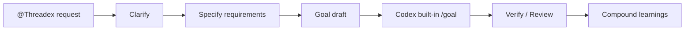

<div align="center">
  

  <h1>Threadex</h1>

  <p><strong>Codex 작업을 모호한 요청에서 검증 가능한 /goal 프롬프트로 엮는 얇은 harness</strong></p>

  <p>
    <a href="#0-간단한-설명"><strong>간단한 설명</strong></a>
    ·
    <a href="#1-marketplace-추가-threadex-설치"><strong>Threadex 설치</strong></a>
    ·
    <a href="#2-subagents-설치"><strong>Subagents 설치</strong></a>
    ·
    <a href="#3-전체적인-구조"><strong>구조</strong></a>
    ·
    <a href="#4-사용방법"><strong>사용방법</strong></a>
  </p>

  <p>
    
    
    
  </p>
</div>

---

## 0. 간단한 설명

Threadex는 Codex에게 일을 맡기기 전에 **요구사항을 명확히 하고**, **검증 가능한 기준을 만들고**, **Codex 내장 `/goal`에 넣을 프롬프트로 정리하는** 얇은 harness입니다.

Codex가 바로 구현으로 뛰어들기보다 아래 순서로 근거를 남기게 합니다.

| 자주 생기는 문제 | Threadex가 고정하는 것 | 쉬운 뜻 |
| --- | --- | --- |
| 요구사항이 모호함 | `clarify` | 한 번에 한 질문으로 빠진 조건 확인 |
| 구현 전에 기준이 없음 | `specify` | 검증 가능한 요구사항 작성 |
| `/goal` 입력이 장황함 | `goal-draft` | 4000자 이하 목표 프롬프트 작성 |
| 완료 주장이 약함 | `verify`, `review` | 테스트, 파일, 결과 근거 확인 |
| 다음 작업에 배움이 남지 않음 | `compound` | 재사용할 교훈만 정리 |

> [!IMPORTANT]
> Codex app의 Threadex plugin 설치와 Threadex subagents 설치는 별도입니다.
> Marketplace 설치로는 Threadex plugin과 skills가 활성화되고,
> subagents는 `~/.codex/agents/` 또는 `.codex/agents/`에 따로 복사해야 합니다.

## 1. Marketplace 추가, Threadex 설치

Codex app에서는 먼저 Threadex Marketplace를 추가하고, 그 안에서 Threadex plugin을 설치합니다.

1. Codex app 좌측 상단의 플러그인 tab을 엽니다.
2. Marketplace 선택 버튼을 누릅니다. 기본 상태라면 `Built by OpenAI`로 보입니다.
3. 열린 Marketplace 목록 팝업 하단에서 `+ 더 추가`를 누릅니다.
4. `마켓플레이스 추가` 창에 아래 값을 넣습니다.

| 입력 칸 | 값 |
| --- | --- |
| 출처 | `https://github.com/jaehoonE7877/threadex` |
| Git ref | `main` |
| Sparse 경로 | `.agents/plugins`<br />`plugins/threadex` |

`Sparse 경로`는 한 칸에 아래처럼 줄바꿈해서 입력합니다.

```txt
.agents/plugins
plugins/threadex
```

5. `마켓플레이스 추가`를 누릅니다.
6. Marketplace 목록에서 Threadex를 찾아 설치합니다.
7. 새 Codex 작업에서 `@Threadex`를 멘션하거나, “Threadex로 이 요청을 /goal 프롬프트로 정리해줘”처럼 요청합니다.

CLI로 Marketplace만 추가하려면 같은 설정을 아래처럼 넣을 수 있습니다.

```bash
codex plugin marketplace add https://github.com/jaehoonE7877/threadex \
  --ref main \
  --sparse .agents/plugins \
  --sparse plugins/threadex
```

> [!NOTE]
> 위 명령은 Codex가 Threadex Marketplace를 찾을 수 있게 등록합니다.
> 등록 후 Codex app의 Marketplace 목록에서 Threadex plugin을 설치하세요.

## 2. Subagents 설치

Codex의 custom subagents는 plugin 내부 파일만으로 자동 등록되지 않습니다.
Codex는 custom agent TOML을 `~/.codex/agents/` 또는 프로젝트의 `.codex/agents/`에서 읽습니다.
Threadex subagents를 쓰려면 agent contract를 그 위치로 복사해야 합니다.

모든 Codex 작업에서 쓰려면 사용자 전역 agents 폴더에 복사합니다.

```bash
mkdir -p ~/.codex/agents
cp plugins/threadex/codex/agents/*.toml ~/.codex/agents/
```

이 repo 안에서만 쓰려면 프로젝트 agents 폴더에 복사합니다.

```bash
mkdir -p .codex/agents
cp plugins/threadex/codex/agents/*.toml .codex/agents/
```

복사 후 Codex를 재시작하거나 새 작업을 시작한 뒤 `/agent`에서 확인합니다.
custom 이름이 보이지 않으면 내장 `explorer`, `worker`, `default` agent를 쓰고,
필요한 contract를 `plugins/threadex/codex/agents/*.toml`에서 함께 전달하세요.

> [!NOTE]
> `npm`이나 `npx` 같은 별도 CLI로 이 복사 과정을 감쌀 수는 있습니다.
> 다만 현재 필요한 동작은 TOML 파일을 Codex agents 폴더로 복사하는 것뿐이라,
> 별도 패키지보다 위 명령이 더 단순하고 유지보수 부담이 적습니다.

## 3. 전체적인 구조

Threadex의 기본 흐름은 `clarify -> specify -> goal-draft -> verify/review -> compound`입니다.



| 단계 | 하는 일 | 결과물 |
| --- | --- | --- |
| 1 | 모호한 요청을 한 질문씩 명확히 함 | clarified summary |
| 2 | 구현 전에 검증 가능한 요구사항 작성 | requirements |
| 3 | Codex 내장 `/goal`에 넣을 텍스트 작성 | `/goal` prompt |
| 4 | Codex가 목표를 실행 | implementation evidence |
| 5 | 결과를 파일, 테스트, 명령으로 확인 | PASS / FAIL / BLOCKED |
| 6 | 다음 작업에 쓸 교훈만 정리 | learnings |

| 보고 싶은 것 | 위치 |
| --- | --- |
| Codex plugin manifest, skills, icon assets | [plugins/threadex](plugins/threadex) |
| Threadex skill 목록 | [plugins/threadex/skills](plugins/threadex/skills) |
| Threadex subagent contracts | [plugins/threadex/codex/agents](plugins/threadex/codex/agents) |
| Smoke testing guide | [docs/smoke-testing.md](docs/smoke-testing.md) |
| Hoyeon reference map | [docs/hoyeon-reference-map.md](docs/hoyeon-reference-map.md) |

Threadex는 Hoyeon의 requirements-first 흐름과 Codex adapter 아이디어를 참고하지만, 기본 경로는 더 얇게 유지합니다.
현재 제품 기준과 배포 구조는 이 GitHub repo를 기준으로 관리합니다.

- GitHub Canonical SSoT: https://github.com/jaehoonE7877/threadex

## 4. 사용방법

가장 짧은 흐름은 `clarify`로 모호함을 줄이고, `goal-draft`로 Codex 내장 `/goal`에 넣을 프롬프트를 만드는 것입니다.

```text
$clarify "설정 화면에 다크 모드 토글을 추가하고 싶어"
$specify "다크 모드 토글 요구사항을 작성해줘"
$goal-draft "이 requirements.md를 Codex /goal로 압축해줘"
```

검증이 필요한 결과에는 아래처럼 요청합니다.

```text
$verify "이 구현이 requirements를 만족하는지 확인해줘"
$review "이 diff에 ship blocker가 있는지 리뷰해줘"
$compound "이번 실행에서 다음에 재사용할 교훈을 정리해줘"
```

| Skill | 언제 쓰나 | 예시 |
| --- | --- | --- |
| `clarify` | 요구가 아직 모호할 때 | “질문을 한 번에 하나씩 해줘” |
| `specify` | 구현 전에 요구사항을 고정할 때 | “검증 가능한 PRD로 바꿔줘” |
| `goal-draft` | Codex 내장 `/goal` 프롬프트가 필요할 때 | “4000자 이하 /goal로 만들어줘” |
| `verify` | 완료 주장을 증거로 확인할 때 | “정말 끝났는지 검증해줘” |
| `review` | diff나 PR 위험을 볼 때 | “ship blocker만 찾아줘” |
| `compound` | 실행 후 배움을 남길 때 | “다음에 재사용할 교훈만 정리해줘” |

로컬에서 플러그인 구조와 smoke contract를 직접 확인하려면 아래 명령을 실행합니다.

```bash
python3 plugins/threadex/scripts/validate_threadex.py plugins/threadex
python3 /Users/jaehoonseo/.codex/skills/.system/plugin-creator/scripts/validate_plugin.py plugins/threadex
```
