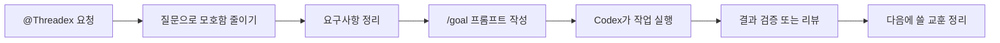

<div align="center">
  

  <h1>Threadex</h1>

  <p><strong>Codex에게 일을 맡기기 전에 요청을 또렷하게 정리해주는 도구</strong></p>

  <p>
    <a href="#0-threadex가-뭔가요"><strong>간단한 설명</strong></a>
    ·
    <a href="#1-threadex-설치하기"><strong>설치</strong></a>
    ·
    <a href="#2-subagents-설치하기-선택"><strong>Subagents</strong></a>
    ·
    <a href="#3-어떻게-돌아가나요"><strong>구조</strong></a>
    ·
    <a href="#4-어떻게-쓰나요"><strong>사용법</strong></a>
  </p>

  <p>
    
    
    
  </p>
</div>

---

## 0. Threadex가 뭔가요?

Threadex는 Codex에게 바로 “구현해줘”라고 맡기기 전에, 요청을 더 안전하게 정리해주는 Codex plugin입니다.

예를 들어 “설정 화면에 다크 모드를 넣어줘”처럼 조금 막연한 요청이 있을 때, Threadex는 먼저 빠진 조건을 확인하고, 요구사항을 정리하고, Codex의 `/goal`에 넣기 좋은 목표 문장으로 바꿔줍니다.

| 이런 상황에서 | Threadex가 도와주는 일 |
| --- | --- |
| 요청이 애매함 | 필요한 질문을 하나씩 정리 |
| 무엇을 만들지 기준이 없음 | 확인 가능한 요구사항 작성 |
| Codex `/goal`에 넣을 말이 길거나 어수선함 | 성공 기준과 경계가 분명한 목표 프롬프트 작성 |
| 정말 끝났는지 모르겠음 | 파일, 테스트, 결과 근거로 확인 |
| 다음 작업에도 배움을 남기고 싶음 | 재사용할 교훈 정리 |

> [!IMPORTANT]
> Threadex plugin 설치와 subagents 설치는 별도입니다.
> 처음 사용하는 경우에는 **1번 설치만 먼저 해도 됩니다.**
> 더 세밀한 검토 역할까지 쓰고 싶을 때만 2번 subagents 설치를 추가로 진행하세요.

## 1. Threadex 설치하기

ChatGPT 데스크톱 앱의 Codex에서 Threadex를 쓰려면 먼저 Threadex Marketplace를 추가하고, 그 안에서 Threadex plugin을 설치합니다.
여기서 Marketplace는 Codex plugin을 찾는 목록이라고 보면 됩니다.

1. ChatGPT 데스크톱 앱에서 Codex를 선택한 뒤 좌측 상단의 플러그인 tab을 엽니다.
2. `Built by OpenAI`라고 보이는 Marketplace 선택 버튼을 누릅니다.
3. 열린 목록 아래쪽의 `+ 더 추가`를 누릅니다.
4. `마켓플레이스 추가` 창에 아래 값을 그대로 넣습니다.

| 입력 칸 | 넣을 값 |
| --- | --- |
| 출처 | `https://github.com/jaehoonE7877/threadex` |
| Git ref | `main` |
| Sparse 경로 | `.agents/plugins`<br />`plugins/threadex` |

`Sparse 경로` 칸에는 아래처럼 두 줄로 넣으면 됩니다.

```txt
.agents/plugins
plugins/threadex
```

5. `마켓플레이스 추가`를 누릅니다.
6. Marketplace 목록에서 `Threadex`를 찾아 설치합니다.
7. 새 Codex 작업에서 `@Threadex`를 멘션해서 사용합니다.

터미널을 사용할 줄 안다면 아래 명령으로 Marketplace만 추가할 수도 있습니다.

```bash
codex plugin marketplace add https://github.com/jaehoonE7877/threadex \
  --ref main \
  --sparse .agents/plugins \
  --sparse plugins/threadex
```

## 2. Subagents 설치하기 (선택)

Subagents는 Codex 안에서 특정 역할을 맡는 보조 작업자입니다.
Threadex는 코드 탐색, 문서 확인, 검증, 리뷰 같은 역할을 위한 subagent 설정을 함께 제공합니다.

대부분의 사용자는 이 단계를 건너뛰어도 됩니다.
Threadex를 더 깊게 쓰고 싶을 때만 아래 단계를 진행하세요.

### 모든 Codex 작업에서 쓰기

터미널을 열고, Threadex 파일을 내려받은 폴더에서 아래 명령을 실행합니다.

```bash
mkdir -p ~/.codex/agents
cp plugins/threadex/codex/agents/*.toml ~/.codex/agents/
```

### 이 repo 안에서만 쓰기

```bash
mkdir -p .codex/agents
cp plugins/threadex/codex/agents/*.toml .codex/agents/
```

복사한 뒤 Codex를 재시작하거나 새 작업을 시작하세요.
그 다음 Codex에게 `code-explorer` 같은 Threadex subagent를 실행하도록 요청하고, `/agent`에서 생성된 subagent 작업을 확인하면 됩니다.

## 3. 어떻게 돌아가나요?

Threadex의 기본 흐름은 아래와 같습니다.



| 단계 | 하는 일 | 결과 |
| --- | --- | --- |
| 1 | 빠진 조건을 질문으로 확인 | 더 명확한 요청 |
| 2 | 구현 전에 기준 정리 | 요구사항 |
| 3 | Codex `/goal`에 넣을 문장 작성 | 목표 프롬프트 |
| 4 | Codex가 작업 실행 | 구현 결과 |
| 5 | 결과가 맞는지 확인 | PASS(통과) / FAIL(실패) / BLOCKED(막힘) |
| 6 | 다음 작업에 쓸 점 정리 | 배운 점 |

Threadex의 프롬프트는 GPT-5.6 권장 방식에 맞춰 결과를 먼저 정의합니다. 각 단계는 필요한 성공 근거와 제약만 명시하고, 이미 허용된 작업을 다시 승인받지 않습니다. 근거가 부족하거나 막힌 상태는 완료로 처리하지 않습니다.

Subagent는 작업 성격에 따라 나뉩니다. 파일·문서 탐색처럼 읽기 중심 작업은 `gpt-5.6-terra`와 낮은 추론 강도를 사용하고, 검증·리뷰처럼 판단이 중요한 작업은 `gpt-5.6`과 높은 추론 강도를 사용합니다.

### 배운 점은 어디에 저장되나요?

Threadex는 배운 점을 여러 곳에 흩어두지 않습니다.
AI가 읽는 파일은 한 폴더에 모으고, 사람이 읽는 문서는 따로 둡니다.

```text
.threadex/learnings/ledger.json
.threadex/learnings/index.json
docs/learnings/{YYYY-MM-DD}-{short-title}.md
```

| 위치 | 누가 읽나요? | 역할 |
| --- | --- | --- |
| `.threadex/learnings/ledger.json` | AI | 작업 중 나온 raw learning을 모두 모으는 원장 |
| `.threadex/learnings/index.json` | AI | 다음 `specify`가 빠르게 읽는 요약 색인 |
| `docs/learnings/*.md` | 사람 | `$threadex:compound`가 정리한 읽기 쉬운 장기 문서 |

`spec`이 있거나 PR, 브랜치, 요구사항 파일이 있어도 ledger 파일을 새로 나누지 않습니다.
대신 `ledger.json` 안의 `source` 필드로 어디서 나온 learning인지 기록합니다.
다음 `specify`는 먼저 `index.json`을 보고, 더 자세한 설명이 필요할 때만 연결된 `docs/learnings/*.md` 문서를 엽니다.
사람이 읽는 `docs/learnings` 문서 이름은 기본적으로 날짜와 짧은 제목을 쓰지만, repo에 이미 다른 파일명 규칙이 있으면 그 규칙을 먼저 따릅니다.

더 자세한 파일은 아래에서 볼 수 있습니다.

| 보고 싶은 것 | 위치 |
| --- | --- |
| Threadex plugin 전체 | [plugins/threadex](plugins/threadex) |
| Threadex 기능 목록 | [plugins/threadex/skills](plugins/threadex/skills) |
| Threadex subagents 설정 | [plugins/threadex/codex/agents](plugins/threadex/codex/agents) |
| 개발자용 테스트 안내 | [docs/smoke-testing.md](docs/smoke-testing.md) |

## 4. 어떻게 쓰나요?

새 Codex 작업에서 `@Threadex`를 부른 뒤, 원하는 일을 자연스럽게 말하면 됩니다.

```text
@Threadex 이 요청을 먼저 명확하게 정리해줘.
설정 화면에 다크 모드 토글을 추가하고 싶어.
```

요구사항을 만들고 싶다면 이렇게 말합니다.

```text
@Threadex 이 작업을 검증 가능한 요구사항으로 바꿔줘.
```

Codex `/goal`에 넣을 문장을 만들고 싶다면 이렇게 말합니다.

```text
@Threadex 이 요구사항을 Codex /goal 프롬프트로 정리해줘.
```

끝났는지 확인하고 싶다면 이렇게 말합니다.

```text
@Threadex 이 구현이 요구사항을 만족하는지 검증해줘.
```

Threadex 기능 이름을 직접 써도 됩니다.

| 이름 | 언제 쓰나요? |
| --- | --- |
| `$threadex:clarify` | 요청이 아직 애매할 때 |
| `$threadex:specify` | 요구사항을 정리하고 싶을 때 |
| `$threadex:goal-draft` | Codex `/goal`에 넣을 문장이 필요할 때 |
| `$threadex:verify` | 끝났다는 주장을 확인하고 싶을 때 |
| `$threadex:review` | 변경사항에 위험한 문제가 있는지 보고 싶을 때 |
| `$threadex:compound` | 이번 작업에서 배운 점을 남기고 싶을 때 |

Threadex의 제품 기준과 배포 기준은 이 GitHub repo에서 관리합니다.

- GitHub Canonical SSoT: https://github.com/jaehoonE7877/threadex
